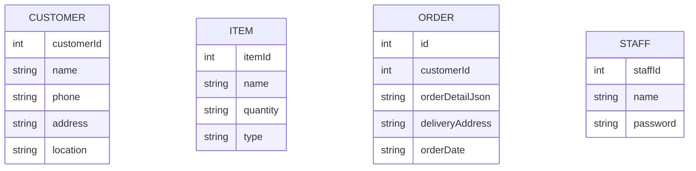

# Overview
This project has 2 projects in this repository.

## Project Website frontend using Angular and Responsive Design
### Tool Framework
- Angular
- Bootstrap
- Ajax
- Websocket

### There are 5 pages
- Login Page is main page
- Form Order
- Order Dashboard
- Filter Search History
- Customer Page

#### Login Page 
There is a Login Modals-center-only PASSWORD no username on the page. After login in will 
show a nav bar depending on permission. 

Admin
- It will show all Nav "Form Page", "Order Dashboard Page",
"Filter Search History Page"
Sale
- It will show only "Form Page" and "Order Dashboard Page
Staff
- It will show only "Order Dashboard Page"
Delivery
- It will show only "Order Dashboard Page"

#### Form Page
There is a Form Modals center on the page and Button to Submit.
In from
1. Customer Name: Dropdown and Search Icon to Search Customer
2. Address: get address data from Customer
3. Location: get location data from Customer
4. Note: Textarea
5. List Item: List of the latest Item and Quantity query from "ORDER" database
   5.1 List item is able to add more and delete existing item

#### Order Dashboard Page
Dashboard will show 7 Date from the current day similar Weekly planning
In the column will show the order on that day. I want to show order detail like a card. In the card there is status can be change by click on the status button 
and show real-time status might use websocket if you have a better solution, tell me.

#### Filter Search History Page
On top panel, filter Customer and Date to query data and show the result table below

#### Customer Page
Costomer Page can be Get, Create, Edit, Delete. 
Forms have
- Customer Name
- Phone
- Address
- Location

## Project Backend using Spring Boot
There are "CUSTOMER" controller to read ,add, edit, delete in the database
and "Form" controller to add "ORDER" in the database
and "Order Dashboard" controller to query "ORDER" database and using websocket to update status

## Database Schema
